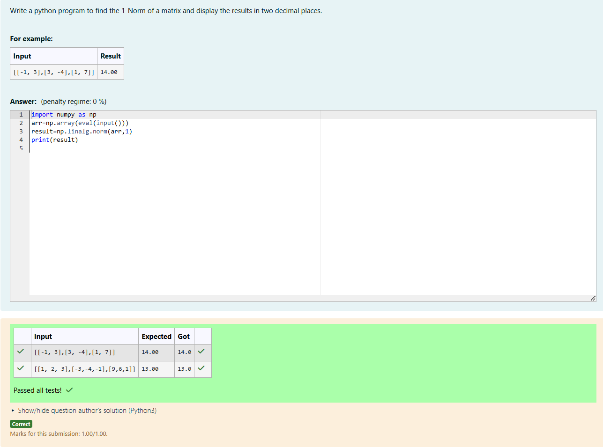
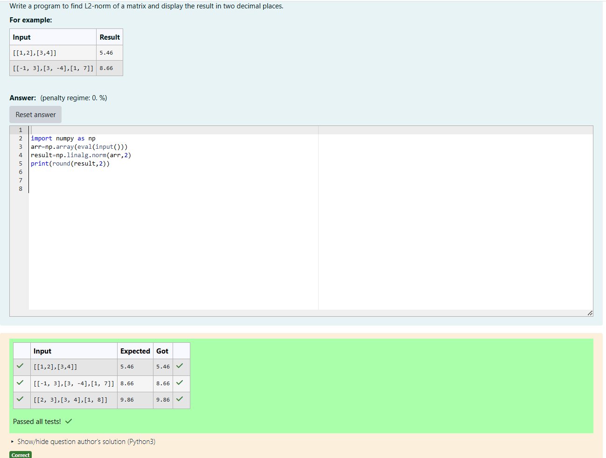
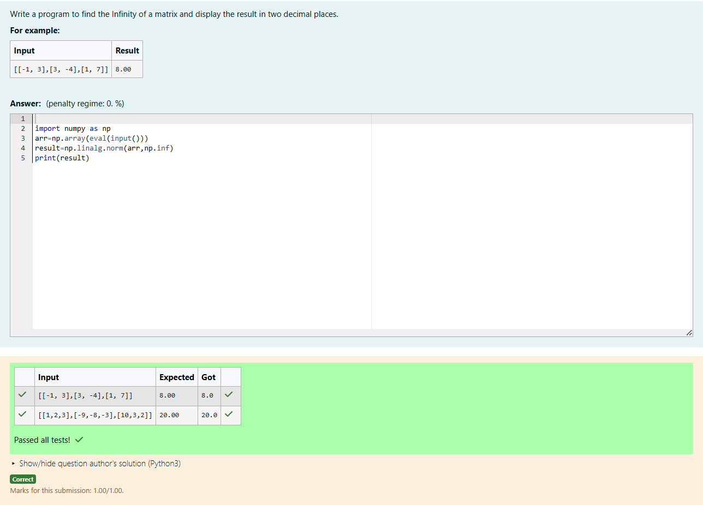

# Norm of a matrix
## Aim
To write a program to find the 1-norm, 2-norm and infinity norm of the matrix and display the result in two decimal places.
## Equipment’s required:
1.	Hardware – PCs
2.	Anaconda – Python 3.7 Installation / Moodle-Code Runner
## Algorithm:
1-Norm of a Matrix
1. The input is Accept a matrix  A of size 𝑚 x n.
2. Absolute Values: Compute the absolute value of each element in A.
3. Column Sums: Compute the sum of elements for each column.
4. Maximum Column Sum: Identify the maximum column sum.
5. Result: The maximum column sum is the 1-Norm of the matrix.
6. Output: Return the 1-Norm.

2-Norm of a Matrix

1. Input: Accept a matrix  A of size  m×n.
2. Singular Values: Use singular value decomposition (SVD) to compute singular values of  A.
3. Largest Singular Value: Identify the largest singular value from the computed set.
4. Result: The largest singular value is the 2-Norm of the matrix.
5. Round: Round the result to the desired number of decimal places, if needed.
6. Output: Return the 2-Norm.

Infinity Norm of a Matrix

1. For each row in A, replace each element with its absolute value.
2. Compute the sum of all elements in each row.
3. Identify the row with the largest sum.
4. Assign this largest row sum as the Infinity Norm.
5. Display the computed Infinity Norm.
## Program:
```Python
# Register No:24005508
# Developed By:RASINDHAN R
# 1-Norm of a Matrix
import numpy as np
arr=np.array(eval(input()))
result=np.linalg.norm(arr,1)
print(result)

# 2-Norm of a Matrix

import numpy as np
arr=np.array(eval(input()))
result=np.linalg.norm(arr,2)
print(round(result,2))

# Infinity Norm of a Matrix

import numpy as np
arr=np.array(eval(input()))
result=np.linalg.norm(arr,np.inf)
print(result)


```
## Output:
### 1-Norm of a Matrix


### 2-Norm of a Matrix


### Infinity Norm of a Matrix


## Result
Thus the program for 1-norm, 2-norm and Infinity norm of a matrix are written and verified.
